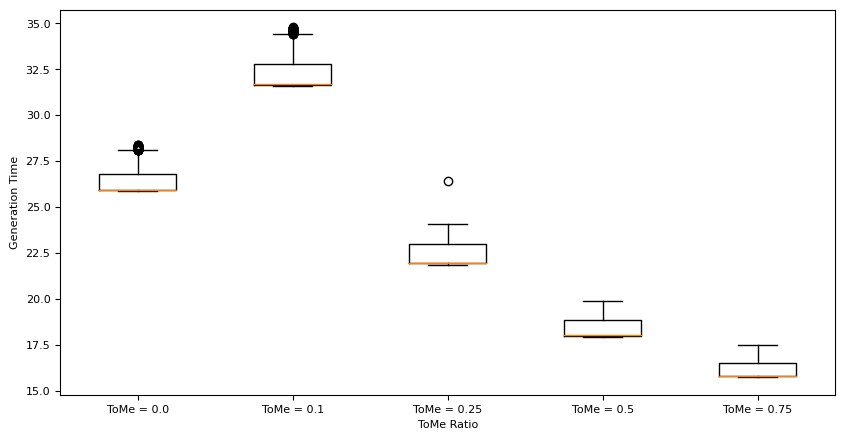

# Token Merging for Fast Stable Diffusion: An Analysis of Performance

As part of my final project for my class on Advanced Deep Learning (CS104: Advanced Deep Learning, Harvard Extension School), I have implementated and evaluated the technique outlined in the paper - [Token Merging for Fast Stable Diffusion](https://paperswithcode.com/paper/token-merging-for-fast-stable-diffusion).

Image generation models like Stable Diffusion require significant time & cost even for inference tasks. While there has been development around speeding up these models (like Flash Attention, xFormers), there remains scope to make them faster since the computation scales with the square of the number or tokens / pixels in an image.

The authors, in their paper, propose Token Merging (ToMe) of redundant tokens (or pixels) in an image to reduce the amount of work to be done by the Transformer Layers. This can be done without any re-training requirements on the model and stacks on top of other approaches mentioned above.

For the purpose of this project, I have implemented the following steps:
- Stable Diffusion Model implemented on AWS Cloud
- Token Merging patching implemented within the Inference call from Stable Diffusion
- Conducted various tests, namely:
    - Deterministic image generation using seeds
    - Image generation at different levels of token merging
    - Evaluation of efficacy of process covering: Generation time & Difference in Image from Baseline

I will, in the course of my project, attempt to showcase & demonstrate the following core outcomes:
- End to end deployment of Stable Diffusion & Token Merging libraries
- Token Merging leads to significant gains in processing efficiency
- This gain, however, comes at a cost in image quality - which is not apparent in the testing techniques used by the authors and requires more rigorous testing with real-life use cases.
## Results Summary

#### Impact on Generation Time using Complex Prompts

In terms of generation time, no matter the prompt, ToMe leads to significant improvements in generation time.

#### Impact on Generated Image - MSE

Since I have used “seeds” effectively in the Stable Diffusion process (as showcased earlier), the end images being generated should have been deterministic i.e. the same across different runs. However, due to the dynamic selection of dst tokens from ToMe, the images are changing and we can see that the difference between images (as judged by MSE) is higher for higher values of r i.e. the ratio of tokens merged.

This can also be visually validated - the left-most images in the below grid are the ones generated without Token Merging, and as we go right, the ratio of tokens being merged is increasing - 10%, 25%, 50% & 75%. We can distinctly see that the images change significantly after we cross 50% token merging.

Initially, my intuition was that longer prompts would lead to more detailed images and hence, Token Merging would lead to larger differences from expected images. However, on analyzing the data, the observation is that shorter prompt length and fewer number of nouns (as a result of shorter prompt length) leads to higher MSEs.

## Detailed Results

You can refer to the complete project details and the overall results at:
[Medium Post](https://linktodocumentation)

## Authors

- [@sahilsakhuja](https://www.github.com/sahilsakhuja)

## License

MIT License

Copyright (c) 2023 Sahil Sakhuja

Permission is hereby granted, free of charge, to any person obtaining a copy
of this software and associated documentation files (the "Software"), to deal
in the Software without restriction, including without limitation the rights
to use, copy, modify, merge, publish, distribute, sublicense, and/or sell
copies of the Software, and to permit persons to whom the Software is
furnished to do so, subject to the following conditions:

The above copyright notice and this permission notice shall be included in all
copies or substantial portions of the Software.

THE SOFTWARE IS PROVIDED "AS IS", WITHOUT WARRANTY OF ANY KIND, EXPRESS OR
IMPLIED, INCLUDING BUT NOT LIMITED TO THE WARRANTIES OF MERCHANTABILITY,
FITNESS FOR A PARTICULAR PURPOSE AND NONINFRINGEMENT. IN NO EVENT SHALL THE
AUTHORS OR COPYRIGHT HOLDERS BE LIABLE FOR ANY CLAIM, DAMAGES OR OTHER
LIABILITY, WHETHER IN AN ACTION OF CONTRACT, TORT OR OTHERWISE, ARISING FROM,
OUT OF OR IN CONNECTION WITH THE SOFTWARE OR THE USE OR OTHER DEALINGS IN THE
SOFTWARE.
